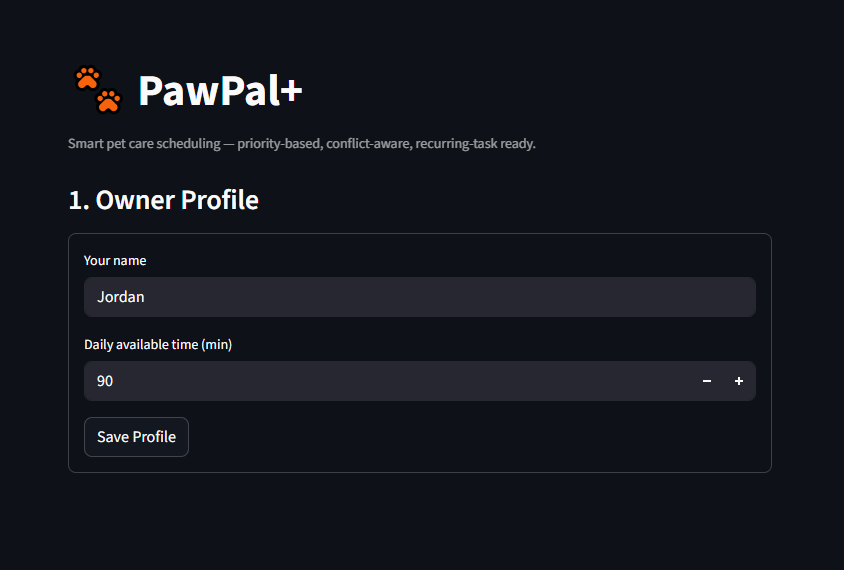

# PawPal+ (Module 2 Project)

A Streamlit app that helps a busy pet owner build a smart daily care schedule across multiple pets.

## Features

- **Owner + multi-pet setup** — create a profile, add as many pets as needed, assign tasks per pet
- **Priority-based scheduling** — tasks are ranked high → medium → low; the scheduler fills the time budget greedily in that order
- **Start-time assignment** — every scheduled task is automatically given a clock start time (e.g. 08:00, 08:30)
- **Sorting by time** — any task list can be sorted chronologically; tasks with no assigned time sort last
- **Filtering** — view all, pending-only, or completed-only tasks across all pets
- **Recurring tasks** — mark a daily or weekly task as recurring; the app shows the next occurrence date automatically
- **Conflict detection** — the scheduler checks for overlapping time windows and surfaces a plain-language warning for each conflict found
- **Reasoning display** — every generated schedule includes an explanation of which tasks were chosen and which were skipped

## 📸 Demo



You are building **PawPal+**, a Streamlit app that helps a pet owner plan care tasks for their pet.

## Scenario

A busy pet owner needs help staying consistent with pet care. They want an assistant that can:

- Track pet care tasks (walks, feeding, meds, enrichment, grooming, etc.)
- Consider constraints (time available, priority, owner preferences)
- Produce a daily plan and explain why it chose that plan

Your job is to design the system first (UML), then implement the logic in Python, then connect it to the Streamlit UI.

## What you will build

Your final app should:

- Let a user enter basic owner + pet info
- Let a user add/edit tasks (duration + priority at minimum)
- Generate a daily schedule/plan based on constraints and priorities
- Display the plan clearly (and ideally explain the reasoning)
- Include tests for the most important scheduling behaviors

## Getting started

### Setup

```bash
python -m venv .venv
source .venv/bin/activate  # Windows: .venv\Scripts\activate
pip install -r requirements.txt
```

## Testing PawPal+

Run the full test suite with:

```bash
python -m pytest
```

**What the tests cover (14 tests):**

| Area | Tests |
|---|---|
| Task behaviour | `mark_complete` flips status; `add_task` increments count |
| Owner/Pet wiring | `add_pet` stores a real `Pet` object, not a dict |
| Sorting | Tasks sort chronologically; untimed tasks go last |
| Recurrence | Daily → +1 day; weekly → +7 days; non-recurring → `None` |
| Conflict detection | Overlapping windows flagged; sequential (touching) windows are not |
| Edge cases | Empty pet → empty schedule; task longer than budget → skipped |
| Filtering | `filter_tasks` by pet name and by completion status |

**Confidence level: ★★★★☆**
Core scheduling logic, sorting, filtering, recurrence, and conflict detection are all covered. The remaining gap is integration-level testing (e.g., full UI flows, session-state persistence), which would require a browser-automation tool beyond the current scope.

## Smarter Scheduling

PawPal+ includes algorithmic enhancements beyond basic task listing:

- **Sorting by time** — `sort_tasks_by_time(tasks)` sorts any task list by assigned start time using a lambda key on `"HH:MM"` strings; tasks without a time sort last.
- **Filtering** — `filter_tasks(tasks, completed=..., pet_name=...)` filters a task list by completion status, pet name, or both.
- **Recurring tasks** — tasks carry a `recurrence` field (`"daily"` or `"weekly"`). After marking one complete, `spawn_next_occurrence(task, from_date)` uses `timedelta` to return a ready-to-add copy due the next day or week.
- **Conflict detection** — `Scheduler.detect_conflicts(schedule)` performs a pairwise O(n²) check over scheduled tasks and returns a plain-language warning for every overlapping time window, without crashing the program.
- **Start-time assignment** — `generate_schedule()` automatically assigns sequential `"HH:MM"` start times to selected tasks, making the daily plan clock-readable at a glance.

### Suggested workflow

1. Read the scenario carefully and identify requirements and edge cases.
2. Draft a UML diagram (classes, attributes, methods, relationships).
3. Convert UML into Python class stubs (no logic yet).
4. Implement scheduling logic in small increments.
5. Add tests to verify key behaviors.
6. Connect your logic to the Streamlit UI in `app.py`.
7. Refine UML so it matches what you actually built.
