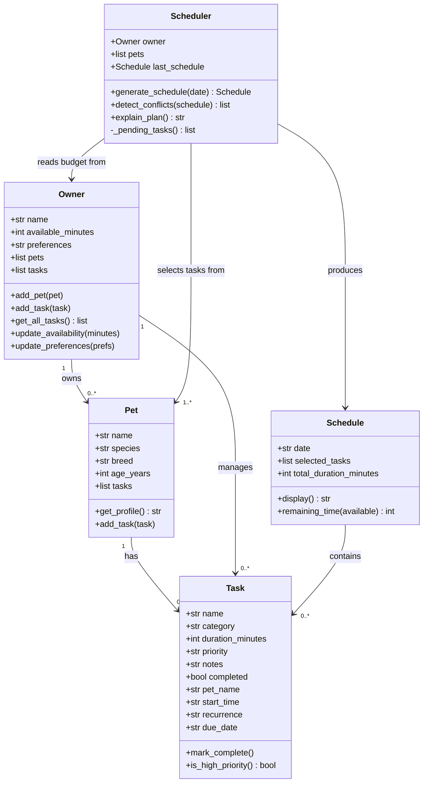

# PawPal+ Project Reflection

## 1. System Design

**a. Initial design**

**Three core user actions:**

1. **Add a pet** — The user enters basic information about their pet (name, species, breed, age) so the system knows who it is planning care for.
2. **Add and edit care tasks** — The user creates tasks such as walks, feeding, medication, or grooming, specifying at minimum a duration and a priority level so the scheduler knows what needs to be done and how important each task is.
3. **Generate and view today's daily plan** — The user requests a daily schedule and receives an ordered list of tasks that fits within their available time, along with a brief explanation of why the plan was arranged that way.

**Brainstormed objects, attributes, and methods:**

- **Owner** — holds the pet owner's name, their total time available per day, and any preferences (e.g., preferred morning/evening split). Can update their availability and preferences.
- **Pet** — holds the pet's name, species, breed, and age. Can return a summary of the pet's profile.
- **Task** — holds the task name, category (walk/feed/meds/etc.), estimated duration in minutes, priority (high/medium/low), and optional notes. Can be marked complete and can report whether it is overdue.
- **Scheduler** — receives the owner, pet, and list of tasks and produces a daily schedule. Sorts and filters tasks based on priority and available time, and can explain its reasoning.
- **Schedule** — holds the date, the ordered list of selected tasks, and the total planned duration. Can display itself clearly and report remaining free time.

**UML Class Diagram:**

The initial design contains five classes. **Owner** is the central actor: it stores the owner's name, daily available time, and preferences, and it holds the lists of pets and tasks. **Pet** is a lightweight value object that holds descriptive information about a single animal (name, species, breed, age) and can produce a readable profile string. **Task** is also a value object representing one care activity; it carries a category, duration, priority, completion flag, and optional notes, and it exposes helpers to mark itself done and to report its own priority level. **Scheduler** is the coordinator: given an owner and a pet it pulls the owner's task list, selects and orders tasks within the time budget, stores the result, and can narrate its reasoning. **Schedule** is the output artifact: it records the chosen date, the ordered list of selected tasks, and the total duration, and it can format itself for display and report remaining free time.

**b. Design changes**

While reviewing the skeleton two problems were found and corrected.

First, `Scheduler.__init__` originally accepted a separate `tasks` parameter alongside `owner`. Because `Owner` already owns a `tasks` list, passing tasks separately creates two sources of truth — any task added through `Owner.add_task()` after the `Scheduler` is created would be invisible to it. The fix was to remove the `tasks` parameter entirely; `generate_schedule()` will read from `self.owner.tasks` directly, so there is only one authoritative list.

Second, `explain_plan()` had no way to reference the schedule it was meant to explain. The fix was to add a `last_schedule` attribute (initialized to `None`) that `generate_schedule()` will populate before returning; `explain_plan()` then reads from `self.last_schedule`. This keeps the two methods decoupled without adding extra parameters.

---

## 2. Scheduling Logic and Tradeoffs

**a. Constraints and priorities**

The scheduler considers three constraints: the owner's available time budget (hard limit — any task whose duration exceeds the remaining minutes is skipped), task priority (high → medium → low ordering within the budget), and completion status (completed tasks are always excluded from pending candidates). Time budget was made the primary hard constraint because over-committing a day is the most damaging failure mode for a pet owner — a skipped walk is recoverable, but a schedule that promises more than 24 hours is useless. Priority determines the ordering once the candidate pool is established, mirroring how a person naturally triages competing demands.

**b. Tradeoffs**

The conflict detector checks for exact time-window overlap (does interval A intersect interval B?) rather than softer conflicts like back-to-back tasks that leave no transition time, or tasks that are logistically incompatible (e.g., two long walks in one morning). This O(n²) pairwise check is a deliberate tradeoff: it is simple to read, trivial to test, and fast enough for the scale of a daily pet care schedule (realistically under 20 tasks). Adding transition-time buffers or logical-incompatibility rules would require domain knowledge that the system does not currently collect, so the exact-overlap check gives the most value for the least added complexity.

---

## 3. AI Collaboration

**a. How you used AI**

AI was used at every phase: brainstorming the initial UML and class responsibilities, generating Python class skeletons from the diagram, implementing method bodies from stubs, writing test cases, and catching design inconsistencies (e.g., the duplicate task-list problem in the Scheduler). The most effective prompt style was narrow and explicit — "implement only this method, do not change any existing signatures" — combined with a constraint about what not to touch. Asking AI to explain *why* it made a structural choice before accepting it was also consistently useful, because the explanation often revealed an assumption that did not apply to this system.

**b. Judgment and verification**

One clear example: the AI initially proposed that `Scheduler.__init__` accept a separate `tasks` parameter alongside `owner`. This was rejected because `Owner` already holds the task list — accepting both would create two sources of truth. The fix was to remove the `tasks` parameter entirely and have `generate_schedule()` call `owner.get_all_tasks()` at runtime. The evaluation was simple: ask "what happens if a task is added to the owner after the scheduler is created?" Under the AI's original design the scheduler would silently miss it; under the corrected design it cannot, because it always reads the live list.

---

## 4. Testing and Verification

**a. What you tested**

The test suite (14 tests) covers: task completion status change, pet task count after `add_task`, pet object storage on owner (verifying `Pet` instance rather than dict), chronological sort correctness with unsorted input, tasks with no start time sorting last, daily and weekly recurrence date arithmetic, `None` return for non-recurring tasks, conflict detection for overlapping intervals, no warning for touching (non-overlapping) sequential intervals, empty schedule when a pet has no tasks, budget overflow causing a task to be skipped, and filtering by pet name and completion status. These tests matter because the most dangerous failures in a scheduler are silent — a task skipped without indication, or a date off by one day — and the tests make those failures immediately visible.

**b. Confidence**

Confidence: 4 out of 5. Core scheduling, sorting, filtering, recurrence arithmetic, and conflict detection are all verified. The remaining gap is integration-level testing — verifying that the app's session state correctly persists objects across reruns and that the UI surfaces every error state the backend can produce. Those tests would require a browser automation tool (e.g., Playwright) beyond the current scope. The edge cases I would test next if time allowed are: two pets each contributing tasks that exactly exhaust the budget in combination, a weekly recurrence crossing a month boundary, and a schedule where all tasks are already completed.

---

## 5. Reflection

**a. What went well**

The separation of concerns worked cleanly throughout. the logic module has no UI imports; `app.py` has no scheduling logic. This meant the entire test suite could run without touching the browser, and that all four algorithmic additions in Phase 4 required zero changes to the UI until integration time. Starting from a UML before writing any code also paid off — the class boundaries were clear enough that each phase built on the previous one without requiring large rewrites.

**b. What you would improve**

The `Task` data class grew to ten fields over the project, several of which are set automatically rather than by the user (`pet_name`, `start_time`). In a next iteration those would be separated into a `ScheduledTask` wrapper that the scheduler creates, keeping the user-facing `Task` as a clean four-field value object. This would also eliminate the mutable shared-reference problem where running a second schedule overwrites the `start_time` on the original task objects, since the scheduler would create fresh wrappers instead of mutating the originals.

**c. Key takeaway**

AI is a strong implementer but a weak architect. It produces working code quickly, but it does not automatically maintain design coherence across the whole system — the duplicate task-list bug early in the project appeared because the AI was not holding the full context of what `Owner` already owned. The lead architect's job is to evaluate every suggestion against the whole-system design, not just whether the code runs, and to ask "what breaks elsewhere if I accept this?" before committing to any AI-generated change.
