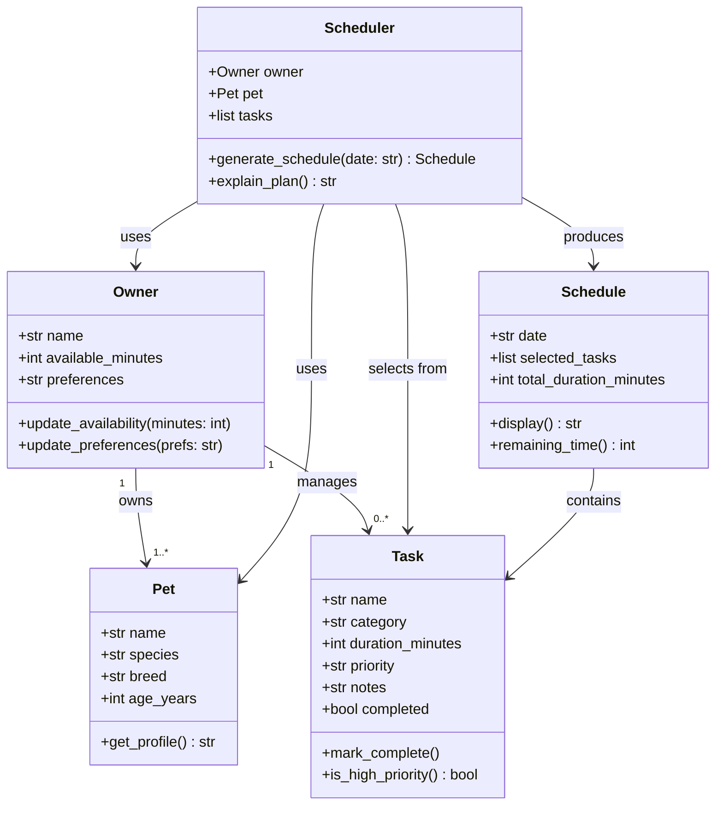

# PawPal+ Project Reflection

## 1. System Design

**a. Initial design**

**Three core user actions:**

1. **Add a pet** — The user enters basic information about their pet (name, species, breed, age) so the system knows who it is planning care for.
2. **Add and edit care tasks** — The user creates tasks such as walks, feeding, medication, or grooming, specifying at minimum a duration and a priority level so the scheduler knows what needs to be done and how important each task is.
3. **Generate and view today's daily plan** — The user requests a daily schedule and receives an ordered list of tasks that fits within their available time, along with a brief explanation of why the plan was arranged that way.

**Brainstormed objects, attributes, and methods:**

- **Owner** — holds the pet owner's name, their total time available per day, and any preferences (e.g., preferred morning/evening split). Can update their availability and preferences.
- **Pet** — holds the pet's name, species, breed, and age. Can return a summary of the pet's profile.
- **Task** — holds the task name, category (walk/feed/meds/etc.), estimated duration in minutes, priority (high/medium/low), and optional notes. Can be marked complete and can report whether it is overdue.
- **Scheduler** — receives the owner, pet, and list of tasks and produces a daily schedule. Sorts and filters tasks based on priority and available time, and can explain its reasoning.
- **Schedule** — holds the date, the ordered list of selected tasks, and the total planned duration. Can display itself clearly and report remaining free time.

**UML Class Diagram:**

The initial design contains five classes. **Owner** is the central actor: it stores the owner's name, daily available time, and preferences, and it holds the lists of pets and tasks. **Pet** is a lightweight value object that holds descriptive information about a single animal (name, species, breed, age) and can produce a readable profile string. **Task** is also a value object representing one care activity; it carries a category, duration, priority, completion flag, and optional notes, and it exposes helpers to mark itself done and to report its own priority level. **Scheduler** is the coordinator: given an owner and a pet it pulls the owner's task list, selects and orders tasks within the time budget, stores the result, and can narrate its reasoning. **Schedule** is the output artifact: it records the chosen date, the ordered list of selected tasks, and the total duration, and it can format itself for display and report remaining free time.

**b. Design changes**

While reviewing the skeleton two problems were found and corrected.

First, `Scheduler.__init__` originally accepted a separate `tasks` parameter alongside `owner`. Because `Owner` already owns a `tasks` list, passing tasks separately creates two sources of truth — any task added through `Owner.add_task()` after the `Scheduler` is created would be invisible to it. The fix was to remove the `tasks` parameter entirely; `generate_schedule()` will read from `self.owner.tasks` directly, so there is only one authoritative list.

Second, `explain_plan()` had no way to reference the schedule it was meant to explain. The fix was to add a `last_schedule` attribute (initialized to `None`) that `generate_schedule()` will populate before returning; `explain_plan()` then reads from `self.last_schedule`. This keeps the two methods decoupled without adding extra parameters.

---

## 2. Scheduling Logic and Tradeoffs

**a. Constraints and priorities**

- What constraints does your scheduler consider (for example: time, priority, preferences)?
- How did you decide which constraints mattered most?

**b. Tradeoffs**

The conflict detector checks for exact time-window overlap (does interval A intersect interval B?) rather than softer conflicts like back-to-back tasks that leave no transition time, or tasks that are logistically incompatible (e.g., two long walks in one morning). This O(n²) pairwise check is a deliberate tradeoff: it is simple to read, trivial to test, and fast enough for the scale of a daily pet care schedule (realistically under 20 tasks). Adding transition-time buffers or logical-incompatibility rules would require domain knowledge that the system does not currently collect, so the exact-overlap check gives the most value for the least added complexity.

---

## 3. AI Collaboration

**a. How you used AI**

- How did you use AI tools during this project (for example: design brainstorming, debugging, refactoring)?
- What kinds of prompts or questions were most helpful?

**b. Judgment and verification**

- Describe one moment where you did not accept an AI suggestion as-is.
- How did you evaluate or verify what the AI suggested?

---

## 4. Testing and Verification

**a. What you tested**

- What behaviors did you test?
- Why were these tests important?

**b. Confidence**

- How confident are you that your scheduler works correctly?
- What edge cases would you test next if you had more time?

---

## 5. Reflection

**a. What went well**

- What part of this project are you most satisfied with?

**b. What you would improve**

- If you had another iteration, what would you improve or redesign?

**c. Key takeaway**

- What is one important thing you learned about designing systems or working with AI on this project?
